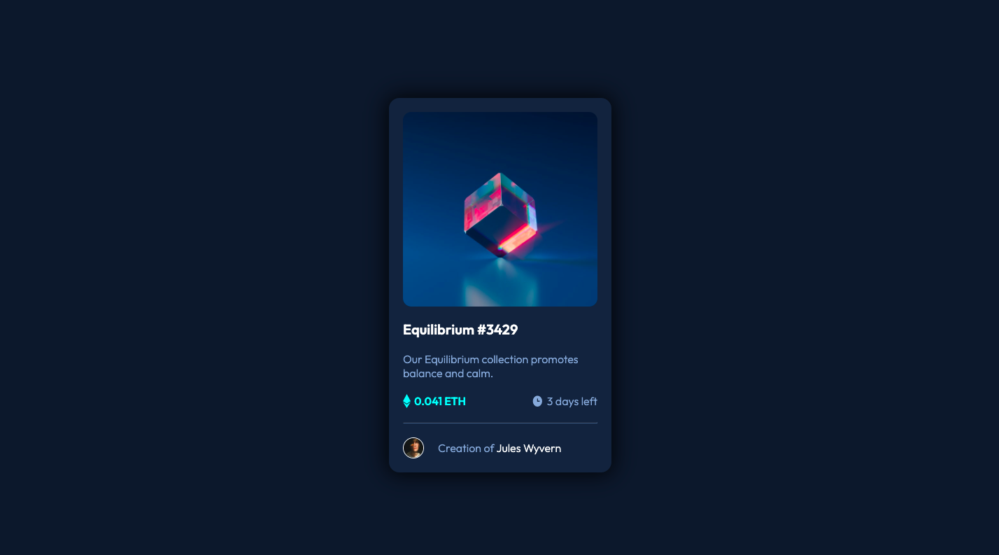

# Frontend Mentor - NFT preview card component solution

This is a solution to the [NFT preview card component challenge on Frontend Mentor](https://www.frontendmentor.io/challenges/nft-preview-card-component-SbdUL_w0U). Frontend Mentor challenges help you improve your coding skills by building realistic projects. 

## Table of contents

- [Overview](#overview)
  - [The challenge](#the-challenge)
  - [Screenshot](#screenshot)
  - [Links](#links)
- [My process](#my-process)
  - [Built with](#built-with)
  - [What I learned](#what-i-learned)
  - [Continued development](#continued-development)
  - [Useful resources](#useful-resources)
- [Author](#author)
- [Acknowledgments](#acknowledgments)

## Overview

### The challenge

Users should be able to:

- View the optimal layout depending on their device's screen size
- See hover states for interactive elements

### Screenshot

### Links

- Solution URL: https://samanthascarcella.github.io/NFT-preview-card-component/
- Live Site URL: https://samanthascarcella.github.io/NFT-preview-card-component/

## My process

### Built with

- Semantic HTML5 markup
- CSS custom properties
- Flexbox
- Mobile-first workflow

### What I learned

- Create a responsive card using flexbox 
- Use of :hover 
- Layering elements to create an overlay

### Continued development

- Use of absolute vs relative positions 

### Useful resources

- N/A

## Author

- Samantha Scarcella - [samanthascarcella] (https://www.github.com)
- Frontend Mentor - [@samanthascarcella](https://www.frontendmentor.io/profile/yourusername)

## Acknowledgments

I would like to thank Frontend Mentor to providing the new developers a chance to further develop their skills and better prepare for work experiences. 
